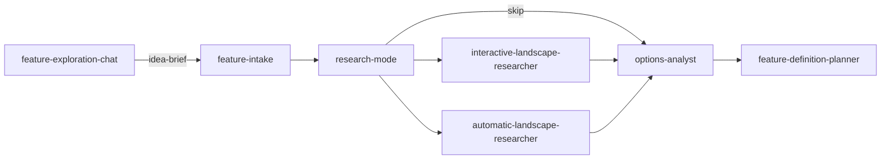

# feature-exploration-planner

Explore app feature ideas with ask-first intake, optional landscape
research, options analysis, and a structured **feature-brief** text output.
Chat-web supports early brainstorming. Planning only; does not implement.

This is a `maiconfz` community package, not an official agents-repo product.
Installed agents reply in the **language the user used** (English if mixed
or unclear).

## Objective

Turn a fuzzy app feature idea into a structured **feature-brief** you can
paste into a GitHub issue or feed downstream planning. Sits **upstream** of:

- `maiconfz/github-interactive-issue-implementation-planner` (issue exists)
- `maiconfz/plan-refiner` (implementation plan exists)

Primary output is **text in the conversation** — no markdown file required.
Optional `output-path` writes `feature-brief` to a host file when provided.

## Workflow



**Q&A policy:** one clarification cycle at intake only (blocking questions).
All other agents run one-shot.

## Install

Prefer the official [agents-repo CLI](https://github.com/agents-repo/cli).

Greenfield (no usable `agents.json` targets yet):

```bash
npx agents-repo@latest init --targets cursor
npx agents-repo@latest install maiconfz/feature-exploration-planner
```

Already configured (targets present in `agents.json`):

```bash
npx agents-repo@latest install maiconfz/feature-exploration-planner
```

- Choose `--targets` for your IDE: `github-copilot`, `cursor`,
  `claude-code`, or `openai-codex` (pass one or more).
- After install, commit `agents.json`, `agents-lock.json`, and the
  extracted install paths when they change.

This README is catalog documentation on `main`; installed content comes
from the versioned deployment ZIPs pinned in your `agents-lock.json`.

## Usage

Two entry paths:

- **Workspace (IDE):** run **`feature-exploration-planning`** in the host
  project with your feature idea as `feature-idea` (prompt text or pasted
  `idea-brief` from chat).
- **Chat-web:** use **`feature-exploration-chat`** for early brainstorming.
  It emits `idea-brief` when evidence exists. For full repo-grounded
  exploration, install in an IDE and run the flow there.

### Inputs

| Input | Required | Description |
| --- | --- | --- |
| `feature-idea` | yes | Prompt text or workspace path to an idea file |
| `research-mode` | no | `interactive`, `automatic`, or `skip`; flow asks if missing |
| `user-clarifications` | no | Answers from the one intake clarification cycle |
| `output-path` | no | Optional path to write `feature-brief`; omit for text only |

### Outputs

| Output | Description |
| --- | --- |
| `feature-brief` | Primary handoff text (markdown-formatted string) |
| `intake-summary` | Framed problem, users, constraints |
| `landscape-report` | Research with citations (empty when skipped) |
| `options-summary` | Options, trade-offs, recommendation |
| `open-questions` | Leftover blockers and non-blocking follow-ups |
| `assumption-log` | From automatic research only |

### After exploration

This package stops at the flow outputs above. Suggested next steps:

1. Copy `feature-brief` into a **new GitHub issue**
2. Run `maiconfz/github-interactive-issue-implementation-planner` with that
   issue number
3. Or draft an implementation plan and run `maiconfz/plan-refiner`

Implementation requires an explicit user request or a different agent.

## Package contents

| Asset | Role |
| --- | --- |
| `feature-exploration-planning` (flow) | Primary IDE entry |
| `feature-exploration-chat` | Chat-web early brainstorming |
| `feature-intake` | Ask-first framing against host repo |
| `interactive-landscape-researcher` | Ask-first landscape research |
| `automatic-landscape-researcher` | Assumption-first landscape research |
| `options-analyst` | Compare approaches and trade-offs |
| `feature-definition-planner` | Synthesize `feature-brief` text |

## Chat-web consumption

This package opts into the chat-web channel via
`compatibility.consumption` with `{ "id": "chat-web", "status": "supported" }`.

Chat-web opens `feature-exploration-chat` by default via `defaultInstruction`.

Only `feature-exploration-chat` sets `chatWeb: "included"`. All workspace
agents and the flow set `chatWeb: "excluded"`. Exclusion affects
`instructions.json` only. Deployment ZIPs still contain every agent and the
flow.

After `package:build`, the instruction manifest for a released version
lives at:

```text
packages/maiconfz/feature-exploration-planner/versions/<version>/instructions.json
```

Registry artifacts use **path-only** `/pkg/...` strings. WebApp consumers
join the registry-proxy origin with those paths per
[`specs/chat-consumption.md`](https://github.com/agents-repo/registry/blob/main/specs/chat-consumption.md):

- **Origin:** `https://registry-proxy.maiconfz.workers.dev`

Illustrative absolute fetch URLs for version `1.0.0`:

```text
https://registry-proxy.maiconfz.workers.dev/pkg/maiconfz/feature-exploration-planner/1.0.0/instructions.json
https://registry-proxy.maiconfz.workers.dev/pkg/maiconfz/feature-exploration-planner/1.0.0/agents/feature-exploration-chat.agent.md
```

## Maintainers

From the registry repository root (package authors / registry contributors):

```bash
PKG=maiconfz/feature-exploration-planner
npm run package:validate -- --package "$PKG"
npm run package:build -- --package "$PKG"
npm run package:validate-artifacts -- --package "$PKG" --version 1.0.0
```

Do not author `detail.json` or any files under `versions/`.
