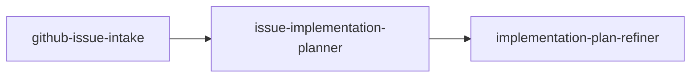

# github-interactive-issue-implementation-planner

Interactive GitHub issue planning: load issue via `gh`, draft and refine an
implementation plan with ask-first clarifications.

## Objective

Interactive GitHub issue workflow: load issue context with `gh`, draft an
ask-first implementation plan, then refine it for gaps and inconsistencies.
**Planning only** — no code changes unless you explicitly request implementation
after the plan is ready.

## Workflow



## Prerequisites

- [GitHub CLI](https://cli.github.com/) authenticated for the target repository
  (`gh auth status`)
- Local checkout of the repository where you intend to implement the issue
- Node.js with `npx` (see the [agents-repo CLI](https://github.com/agents-repo/cli))

## Install

Prefer the official [agents-repo CLI](https://github.com/agents-repo/cli).

Greenfield (no usable `agents.json` targets yet):

```bash
npx agents-repo@latest init --targets cursor
npx agents-repo@latest install maiconfz/github-interactive-issue-implementation-planner
```

Already configured (targets present in `agents.json`):

```bash
npx agents-repo@latest install maiconfz/github-interactive-issue-implementation-planner
```

- Choose `--targets` for your IDE: `github-copilot`, `cursor`, `claude-code`,
  or `openai-codex` (pass one or more).
- After install, commit `agents.json`, `agents-lock.json`, and the extracted
  install paths when they change.
- Extract paths follow the install target (see
  [install-targets](https://github.com/agents-repo/registry/blob/main/specs/install-targets.md));
  invoke the flow or agents by name below.

This README is catalog documentation on `main`; installed content comes from
the versioned deployment ZIPs pinned in your `agents-lock.json`.

## Usage

Invoke the **`issue-implementation-planning`** flow when you need to:

- Turn a GitHub issue into a structured implementation plan
- Clarify requirements before coding (ask-first at intake, plan, and refine)
- Review a draft plan for gaps against issue acceptance criteria

Optional: invoke individual agents when you need a single step only.

### Inputs

| Input | Required | Description |
| --- | --- | --- |
| `issue-reference` | yes | Issue number (for example `42`) or full issue URL |
| `repository` | no | `owner/name` when not inferable from the local checkout |
| `user-clarifications` | no | Answers accumulated across clarification loops |

### Outputs

- `refined-implementation-plan` — final markdown plan after refinement
- `open-questions` — remaining questions (blocking items first when present)

### After planning

This package stops at the flow outputs above. Implementation, draft PR
pre-ready steps, marking ready, and maintainer review follow the **target
repository** and organization
[CONTRIBUTING](https://github.com/agents-repo/.github/blob/main/CONTRIBUTING.md)
(**Pre-ready agent handoff**) — not this package. Request implementation
explicitly if you want the agent to write code after the plan is ready.

## Package contents

| Asset | Role |
| --- | --- |
| `issue-implementation-planning` (flow) | Primary entry: intake → plan → refine |
| `github-issue-intake` | Fetch issue and comment context via `gh` |
| `issue-implementation-planner` | First implementation plan draft |
| `implementation-plan-refiner` | Plan QA and gap fixes |

## Maintainers

From the registry repository root (package authors / registry contributors):

```bash
PKG=maiconfz/github-interactive-issue-implementation-planner
npm run package:validate -- --package "$PKG"
npm run package:build -- --package "$PKG"
npm run package:validate-artifacts -- --package "$PKG" --version 1.1.0
```
