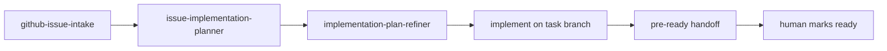
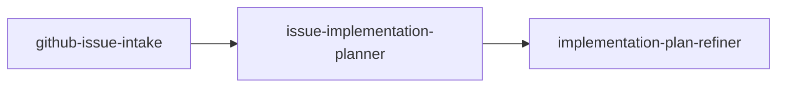

# github-interactive-issue-implementation-planner

## Objective

Interactive GitHub issue workflow: load issue context with `gh`, draft an
ask-first implementation plan, then refine it for gaps and inconsistencies.
**Planning only** — no code changes unless you explicitly request implementation
after the plan is ready.

## Lifecycle

Planning is one phase of a larger delivery flow. Implementation-time pre-ready
steps live in each repository's agent instructions and organization
[CONTRIBUTING](https://github.com/agents-repo/.github/blob/main/CONTRIBUTING.md)
(**Pre-ready agent handoff**).



After refinement, request implementation explicitly. Before a human marks the
PR ready, follow the target repo's validation and self-review expectations.

This package stops at the flow outputs: a **refined implementation plan** and
**open questions** (see the `issue-implementation-planning` flow contract).
Implementation, draft PR pre-ready steps, marking ready, and maintainer review
follow the **target repository** and organization contributor docs—not this
package.

## Workflow



## Prerequisites

- [GitHub CLI](https://cli.github.com/) authenticated for the target repository
  (`gh auth status`)
- Local checkout of the repository where you intend to implement the issue

## Quickstart

1. Install this package for your IDE target (see **Install** below).
2. Invoke the **`issue-implementation-planning`** flow with:
   - `issue-reference`: issue number (for example `42`) or full issue URL
   - optional `repository`: `owner/name` when not working in that repo locally
3. Answer any blocking questions the flow surfaces.
4. Use the returned refined implementation plan; request implementation
   separately if you want the agent to write code.

Optional: invoke individual agents when you need a single step only.

## Install

Install with the [agents-repo CLI](https://github.com/agents-repo/cli):

```bash
npx agents-repo@1.13.0 init --targets github-copilot claude-code cursor openai-codex
npx agents-repo@1.13.0 install maiconfz/github-interactive-issue-implementation-planner
```

Commit `agents.json`, `agents-lock.json`, and extracted paths after install.
GitHub Copilot installs under `.github/agents/`; Claude Code installs under `.claude/agents/`.
Cursor installs under `.cursor/skills/`; OpenAI Codex installs under `.agents/skills/`.

This README is catalog documentation on `main`; installed content comes from
the versioned deployment ZIPs in your `agents-lock.json`.

## Usage

Invoke the **`issue-implementation-planning`** flow when you need to:

- Turn a GitHub issue into a structured implementation plan
- Clarify requirements before coding (ask-first at intake, plan, and refine)
- Review a draft plan for gaps against issue acceptance criteria

Provide an issue number or URL and optional `owner/name` repository.

## Package contents

| Asset | Role |
| --- | --- |
| `issue-implementation-planning` (flow) | Primary entry: intake → plan → refine |
| `github-issue-intake` | Fetch issue and comment context via `gh` |
| `issue-implementation-planner` | First implementation plan draft |
| `implementation-plan-refiner` | Plan QA and gap fixes |

## Validate and build

From the registry repository root:

```bash
PKG=maiconfz/github-interactive-issue-implementation-planner
npm run package:validate -- --package "$PKG"
npm run package:build -- --package "$PKG"
npm run package:validate-artifacts -- --package "$PKG" --version 1.1.1
```
