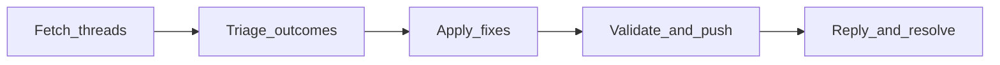

# github-pr-review-triage

## Objective

GitHub-specific agent for triaging pull request review comments on any GitHub
repository. Uses the GitHub CLI (`gh`) to fetch unresolved threads, classify
outcomes, apply fixes, validate and push when permitted, then reply and resolve
threads.

## Workflow



## Prerequisites

- [GitHub CLI](https://cli.github.com/) authenticated for the target repo
- Local checkout on the PR head branch

## Install

Install from the registry for your IDE target:

| Target | Artifact |
| --- | --- |
| GitHub Copilot | `1.0.0-github-copilot.zip` |
| Cursor | `1.0.0-cursor.zip` |
| Claude Code | `1.0.0-claude-code.zip` |
| OpenAI Codex | `1.0.0-openai-codex.zip` |

Extract the ZIP into the project root (or `.github/` for Copilot per target
layout). Cursor installs to `.cursor/skills/github-pr-review-triage/SKILL.md`.

## Usage

Invoke the `github-pr-review-triage` agent when you need to:

- Address Copilot, Bugbot, or human inline review feedback on an open PR
- Batch-triage unresolved review threads before CI fixes
- Close review threads after fixes land on the branch

Provide the repository (`owner/name`), PR number, and whether commit/push is
allowed.

## Package contents

- `agents/github-pr-review-triage.agent.md` — agent definition and workflow
- `agents/github-pr-review-triage.metadata.json` — agent metadata sidecar

## Validate and build

From the registry repository root:

```bash
npm run package:validate -- --package maiconfz/github-pr-review-triage
npm run package:build -- --package maiconfz/github-pr-review-triage
npm run package:validate-artifacts -- \
  --package maiconfz/github-pr-review-triage --version 1.0.0
```
