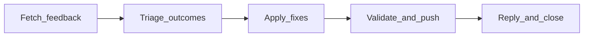

# github-pr-review-triage

GitHub-specific agent: triages PR review threads and Copilot review summaries
via `gh` — fetch, fix, commit, reply, resolve or acknowledge.

## Objective

Triages pull request review feedback on any GitHub repository. Uses the GitHub
CLI (`gh`) to fetch unresolved review threads and Copilot review summaries
(zero inline comments), classify outcomes, apply fixes, validate and push when
permitted, then reply and resolve threads or acknowledge summaries on the PR
conversation.

## Workflow


```mermaid
flowchart LR
  fetch[Fetch_feedback]
  triage[Triage_outcomes]
  fix[Apply_fixes]
  ship[Validate_and_push]
  close[Reply_and_close]

  fetch --> triage --> fix --> ship --> close
```

## Prerequisites

- [GitHub CLI](https://cli.github.com/) authenticated for the target repository
  (`gh auth status`)
- Local checkout on the PR head branch
- Node.js with `npx` (see the [agents-repo CLI](https://github.com/agents-repo/cli))

## Install

Prefer the official [agents-repo CLI](https://github.com/agents-repo/cli).

Greenfield (no usable `agents.json` targets yet):

```bash
npx agents-repo@latest init --targets cursor
npx agents-repo@latest install maiconfz/github-pr-review-triage
```

Already configured (targets present in `agents.json`):

```bash
npx agents-repo@latest install maiconfz/github-pr-review-triage
```

- Choose `--targets` for your IDE: `github-copilot`, `cursor`, `claude-code`,
  or `openai-codex` (pass one or more).
- After install, commit `agents-lock.json` and `agents.json` when they change.
- Extract paths follow the install target (see
  [install-targets](https://github.com/agents-repo/registry/blob/main/specs/install-targets.md));
  invoke the agent by name below.

## Usage

Invoke the **`github-pr-review-triage`** agent when you need to:

- Address Copilot, Bugbot, or human inline review feedback on an open PR
- Address Copilot overview or summary reviews with no inline comments
- Batch-triage unresolved review threads before CI fixes
- Close review threads after fixes land on the branch

### Inputs

| Input | Required | Description |
| --- | --- | --- |
| `repository` | yes | GitHub repository as `owner/name` |
| `pull-request` | yes | Pull request number |
| `push-permission` | yes | Whether commit and push are allowed for this pass |

### Outputs

- `triage-table` — markdown table of items, outcomes, and rationale
- `handoff-summary` — PR URL, commit SHA, resolved/acknowledged counts, notes

Summary acknowledgments appear on the PR conversation timeline (not under the
review card).

## Package contents

- `agents/github-pr-review-triage.agent.md` — agent definition and workflow
- `agents/github-pr-review-triage.metadata.json` — agent metadata sidecar

## Maintainers

From the registry repository root (package authors / registry contributors):

```bash
npm run package:validate -- --package maiconfz/github-pr-review-triage
npm run package:build -- --package maiconfz/github-pr-review-triage
npm run package:validate-artifacts -- \
  --package maiconfz/github-pr-review-triage --version 1.1.0
```
