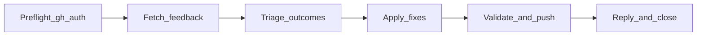

# github-pr-review-triage

GitHub-specific agent: triages PR review threads, Copilot summaries, bot
conversation comments, and orphan inline comments via `gh` — fetch, fix,
commit, push, reply, resolve or acknowledge.

## Objective

Triages pull request review feedback on any GitHub repository. Uses the GitHub
CLI (`gh`) to fetch unresolved review threads, Copilot review summaries (zero
inline comments), bot conversation comments on the PR timeline, and orphan
inline review comments from REST, classify outcomes, apply fixes, validate,
then **automatically** commit, push, reply, resolve threads, and acknowledge
non-thread feedback when `gh` is authenticated (default). Pass `dry-run: true`
for review-only mode without shipping.

Phase 1 always runs all four fetches before triage — conversation and orphan
inline items are not skipped when unresolved threads exist.

## Workflow



## Prerequisites

- [GitHub CLI](https://cli.github.com/) authenticated for the target repository
  (`gh auth status`)
- Local checkout on the PR head branch
- Node.js with `npx` (see the [agents-repo CLI](https://github.com/agents-repo/cli))

## Install

Prefer the official [agents-repo CLI](https://github.com/agents-repo/cli).

Greenfield (no usable `agents.json` targets yet):

```bash
npx agents-repo@latest init --targets cursor
npx agents-repo@latest install maiconfz/github-pr-review-triage
```

Already configured (targets present in `agents.json`):

```bash
npx agents-repo@latest install maiconfz/github-pr-review-triage
```

- Choose `--targets` for your IDE: `github-copilot`, `cursor`, `claude-code`,
  or `openai-codex` (pass one or more).
- After install, commit `agents.json`, `agents-lock.json`, and the extracted
  install paths when they change.
- Extract paths follow the install target (see
  [install-targets](https://github.com/agents-repo/registry/blob/main/specs/install-targets.md));
  invoke the agent by name below.

This README is catalog documentation on `main`; installed content comes from
the versioned deployment ZIPs pinned in your `agents-lock.json`.

## Usage

Invoke the **`github-pr-review-triage`** agent when you need to:

- Address Copilot, Bugbot, or human inline review feedback on an open PR
- Address Copilot overview or summary reviews with no inline comments
- Address Bugbot or Cursor bot **conversation** comments (timeline, not in a
  review thread)
- Batch-triage unresolved review threads before CI fixes
- Close review threads after fixes land on the branch

When `gh` is authenticated, the agent commits, pushes, and resolves threads
by default. No extra permission input is required.

### Feedback kinds

| Kind | Typical source |
| --- | --- |
| `thread` | Unresolved inline review threads (GraphQL) |
| `review_summary` | Copilot review with body, zero inline comments |
| `conversation_comment` | Bot PR timeline comment (`issues/.../comments`) |
| `orphan_inline` | Inline REST comment not already on a `thread` row |

### Inputs

| Input | Required | Description |
| --- | --- | --- |
| `repository` | no | GitHub repository as `owner/name` (auto-discovered from current branch when omitted) |
| `pull-request` | no | Pull request number (auto-discovered from current branch when omitted) |
| `dry-run` | no | When `true`, fetch/triage/fix/validate only — no commit, push, or thread resolution. Defaults to `false` |

### Migration from 1.1.x

| 1.1.x | 1.2.0 |
| --- | --- |
| `push-permission: true` | Omit `dry-run` (default is full automation) |
| `push-permission: false` | `dry-run: true` |

### Outputs

- `triage-table` — markdown table of items, outcomes, and rationale
- `handoff-summary` — PR URL, commit SHA, resolved/acknowledged counts, notes

Summary and conversation acknowledgments appear on the PR conversation timeline
(not under the review card).

## Package contents

- `agents/github-pr-review-triage.agent.md` — agent definition and workflow
- `agents/github-pr-review-triage.metadata.json` — agent metadata sidecar

## Maintainers

From the registry repository root (package authors / registry contributors):

```bash
npm run package:validate -- --package maiconfz/github-pr-review-triage
npm run package:build -- --package maiconfz/github-pr-review-triage
npm run package:validate-artifacts -- \
  --package maiconfz/github-pr-review-triage --version 1.3.0
```
