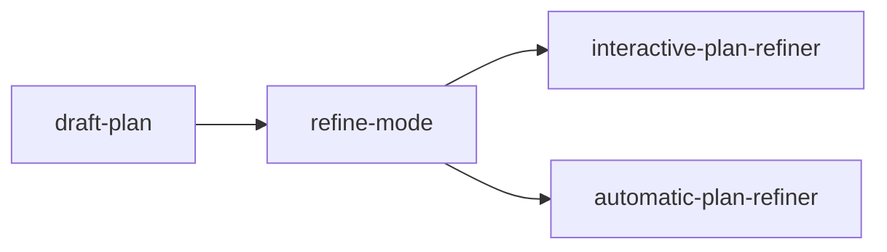

# plan-refiner

Refine an existing feature or implementation plan against the current
repository: find gaps and inconsistencies. Interactive ask-first or
automatic assumption-first. Planning only; does not implement.

This is a `maiconfz` community package, not an official agents-repo
product. Installed agents reply in the **language the user used**
(English if mixed or unclear).

## Objective

Quality-pass an **already written** plan against the **host** repository.
Choose ask-first questions or a one-shot revision with labeled
assumptions. Bounded rediscovery (project rules, cited files, related
modules and tests). Not a first-pass planner.

If you have a GitHub issue number and no plan yet, use
`maiconfz/github-interactive-issue-implementation-planner` instead. This
package does not call `gh` and does not invoke that package.

## Workflow



## Install

Prefer the official [agents-repo CLI](https://github.com/agents-repo/cli).

Greenfield (no usable `agents.json` targets yet):

```bash
npx agents-repo@latest init --targets cursor
npx agents-repo@latest install maiconfz/plan-refiner
```

Already configured (targets present in `agents.json`):

```bash
npx agents-repo@latest install maiconfz/plan-refiner
```

- Choose `--targets` for your IDE: `github-copilot`, `cursor`,
  `claude-code`, or `openai-codex` (pass one or more).
- After install, commit `agents.json`, `agents-lock.json`, and the
  extracted install paths when they change.
- Extract paths follow the install target (see
  [install-targets](https://github.com/agents-repo/registry/blob/main/specs/install-targets.md));
  invoke the flow or agents by name below.

This README is catalog documentation on `main`; installed content comes
from the versioned deployment ZIPs pinned in your `agents-lock.json`.

## Usage

Invoke the **`plan-refinement`** flow after a plan already exists
(Cursor Plan mode, a markdown plan, or a prior planner).

- Use `refine-mode: interactive` when you want to be asked about gaps.
  Later Q&A rounds continue from the latest `refined-plan`, not the
  original paste.
- Use `refine-mode: automatic` when you want a finished revision with an
  assumption log.

`draft-plan` may be pasted markdown or a workspace path to a markdown
plan file. If a source plan file is known (the path you gave, or the
host's current plan file), the selected agent **updates that file
only**. It does not create `refined-plan.md` and does not change product
code.

Optional: invoke a single agent when you need one policy only.

### Inputs

| Input | Required | Description |
| --- | --- | --- |
| `draft-plan` | yes | Markdown body or a workspace path to a plan file |
| `refine-mode` | no | `interactive` or `automatic`; the flow asks if missing |
| `goal` | no | Stated goal or acceptance text |
| `user-clarifications` | no | Answers accumulated across clarification loops |

### Outputs

- `refined-plan` — revised markdown after the selected refiner
- `open-questions` — remaining questions (blocking items first)
- `assumption-log` — labeled assumptions (empty in interactive mode)

### After refinement

This package stops at the flow outputs above. Product implementation
needs an explicit request or a different agent.

## Package contents

| Asset | Role |
| --- | --- |
| `plan-refinement` (flow) | Primary entry: route by `refine-mode` |
| `interactive-plan-refiner` | Ask-first refine; blockers over guesses |
| `automatic-plan-refiner` | Assumption-first one-shot refine |

## Maintainers

From the registry repository root (package authors / registry
contributors):

```bash
PKG=maiconfz/plan-refiner
npm run package:validate -- --package "$PKG"
npm run package:build -- --package "$PKG"
npm run package:validate-artifacts -- --package "$PKG" --version 1.0.0
```

Do not author `detail.json` or any files under `versions/`.
