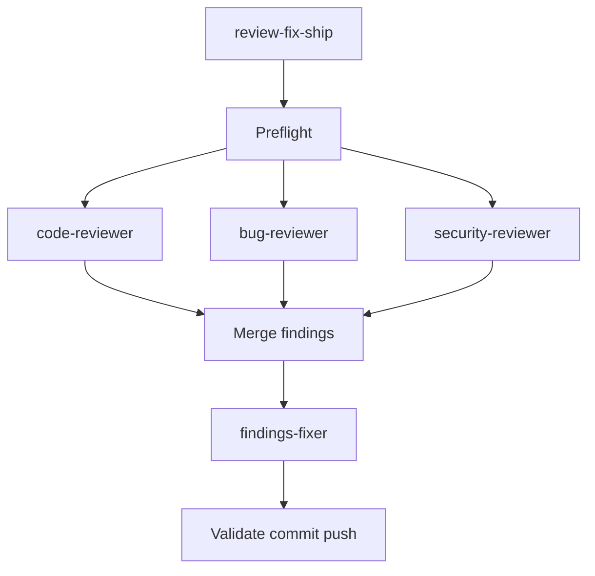

# review-fix-ship

Local diff review then ship: run code, bug, and security reviews (Cursor
Bugbot and Security Review subagents when available; portable fallbacks
otherwise), then triage, fix, commit, and push findings.

This is a `maiconfz` community package, not an official agents-repo
product. It complements `maiconfz/github-pr-review-triage` (GitHub PR
comment threads). This package reviews the **local git diff**, then
ships code on the current feature branch.

## Objective

Drop-in replacement for the chat habit `/code-review`, `/review-bugbot`,
`/review-security`, then “fix, commit and push findings.”

On Cursor, `bug-reviewer` and `security-reviewer` launch the official
Task subagents when the host can. On other IDEs they run equivalent
in-package reviews. `code-reviewer` always runs in-package (`/code-review`
is not a Task subagent). Only `findings-fixer` edits, commits, and
pushes.

Invoking the **`review-fix-ship`** flow grants ship-mode on the current
**feature branch** by default. Pass `dry-run: true` to skip commit and
push. The flow stops if the checkout is the default branch.

Hosts without Cursor Task types still get the three reviews; those
fallback passes are weaker than Bugbot and the Security Review
subagent. The README and agents say so.

## Workflow



## Install

Prefer the official [agents-repo CLI](https://github.com/agents-repo/cli).

Greenfield (no usable `agents.json` targets yet):

```bash
npx agents-repo@latest init --targets cursor
npx agents-repo@latest install maiconfz/review-fix-ship
```

Already configured (targets present in `agents.json`):

```bash
npx agents-repo@latest install maiconfz/review-fix-ship
```

- Choose `--targets` for your IDE: `github-copilot`, `cursor`,
  `claude-code`, or `openai-codex` (pass one or more).
- After install, commit `agents.json`, `agents-lock.json`, and the
  extracted install paths when they change.
- Extract paths follow the install target (see install-targets in this
  registry's `specs/`); invoke the flow or agents by name below.

This README is catalog documentation on `main`; installed content comes
from the versioned deployment ZIPs pinned in your `agents-lock.json`.

## Usage

Invoke the **`review-fix-ship`** flow when you want local reviews, then
fixes shipped on the feature branch.

Optional: invoke a single reviewer when you need one pass only. Review
agents do not edit files. Invoke `findings-fixer` only with a findings
table from those reviews.

### Inputs

| Input | Required | Description |
| --- | --- | --- |
| `dry-run` | no | When `true`, review/triage/fix/validate only — no commit or push. Defaults to `false` |
| `diff` | no | `branch-changes` (default) or `uncommitted-changes` |
| `custom-instructions` | no | Extra review notes; Cursor `Custom Instructions` when subagents run |

### Outputs

- `findings-table` — merged `Severity | Source | Location | Finding`
- `handoff-summary` — branch, commit SHA when pushed, what shipped or why
  not

Do not re-run reviews after a fix pass unless asked. This package does
not reply to GitHub review threads; use
`maiconfz/github-pr-review-triage` after push if a PR already exists.

## Package contents

| Asset | Role |
| --- | --- |
| `review-fix-ship` (flow) | Primary entry: review, merge, fix, ship |
| `code-reviewer` | General-quality review; no file edits |
| `bug-reviewer` | Bug-focused review; Cursor Bugbot when available |
| `security-reviewer` | Security review; Cursor Security Review when available |
| `findings-fixer` | Triage, fix, validate, commit, push |

## Chat-web consumption

This package opts into the chat-web channel via
`compatibility.consumption` (`chat-web` status `supported`). Every
agent and the flow sets `chatWeb: "included"`. None are excluded.

After `package:build`, the instruction manifest for a released version
lives at:

```text
packages/maiconfz/review-fix-ship/versions/<version>/instructions.json
```

Registry artifacts use **path-only** `/pkg/...` strings. WebApp consumers
join the registry origin with those paths per
`specs/chat-consumption.md`:

- **Origin:** `https://registry.agents-repo.org`

Illustrative absolute fetch URLs for version `1.0.0`:

```text
https://registry.agents-repo.org/pkg/maiconfz/review-fix-ship/1.0.0/instructions.json
https://registry.agents-repo.org/pkg/maiconfz/review-fix-ship/1.0.0/agents/code-reviewer.agent.md
https://registry.agents-repo.org/pkg/maiconfz/review-fix-ship/1.0.0/flows/review-fix-ship.agent.md
```

The `review-fix-ship` flow lists step agents in frontmatter/metadata
`agents[]`; `package:build` maps that ordered list to `agentInstructions`
in `instructions.json`.

## Maintainers

From the registry repository root (package authors / registry
contributors):

```bash
PKG=maiconfz/review-fix-ship
npm run package:validate -- --package "$PKG"
npm run package:build -- --package "$PKG"
npm run package:validate-artifacts -- --package "$PKG" --version 1.0.0
```

Do not author `detail.json` or any files under `versions/`.
